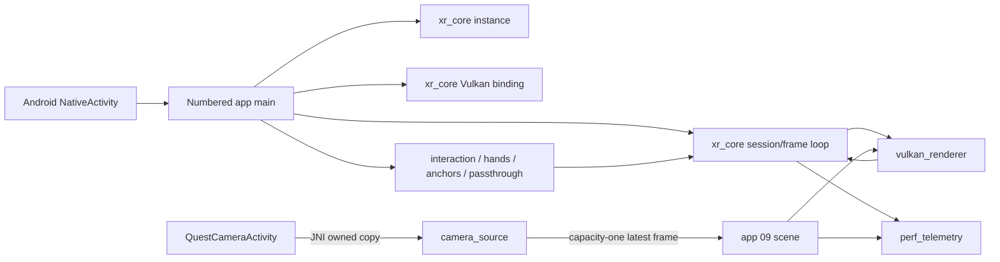
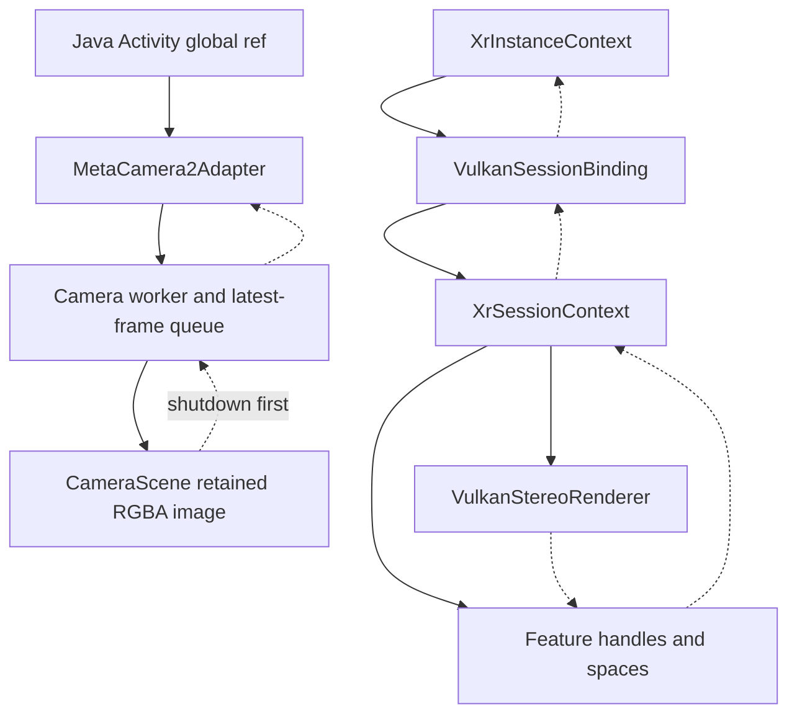

# Native Architecture and Ownership

## Build and runtime assumptions

The repository-owned applications target Android SDK 34, NDK r29, ARM64,
C++17, OpenXR loader 1.1.51, and Vulkan. Quest 3 and Quest 3S are the target
devices. Meta-specific capabilities remain behind small libraries; the shared
telemetry types contain no Android, OpenXR, or Vulkan handles.

No OpenXR extension is required for performance telemetry. Optional timeline
spans use Android `ATrace` and compile only when
`QUEST_ENABLE_PERFETTO_TRACING` is enabled. The minimum repository API level is
26, above the API 23 introduction of the synchronous native tracing calls.

## Component boundaries



- `xr_core` owns portable OpenXR instance/session behavior and the Android
  Vulkan graphics binding.
- `vulkan_renderer` owns the Vulkan instance/device resources supplied by the
  binding, stereo swapchains, render passes, pipelines, and per-eye commands.
- Feature libraries own only their feature handles. They observe session
  events or provide frame updates/layers through narrow interfaces.
- `camera_source` owns the Camera2 adapter boundary and the capacity-one latest
  frame queue. App 09 owns YUV conversion and scene publication.
- `perf_telemetry` owns fixed-capacity CPU-duration samples and immutable
  snapshots. `AddSample` is allocation-free; sorting happens only at the
  bounded publication boundary.

Planned milestone 10–14 components are intentionally absent. Depth,
perception protocol, sensor-rig, and fusion ownership must be added here when
those milestones introduce real code.

## Lifetime and teardown



Each application constructs owners on the native main thread and explicitly
shuts them down in reverse dependency order. `XrSessionContext` owns `VIEW`,
`LOCAL`, and optional `STAGE` spaces, the session handle, reusable layer
storage, and its private telemetry collector. The collector is destroyed only
after the frame loop stops. App 09 stops Camera2 and clears its JNI-visible
adapter pointer before renderer/session teardown.

Partial initialization remains safe because every owner accepts repeated
`Shutdown` calls and checks handles before destruction. `xrEndSession` is used
only after `STOPPING`; activity destruction otherwise destroys the session
directly.

## Frame and thread model

The native application thread processes Android events, calls
`XrSessionContext::PollEvents`, and then pumps a frame while the session is
running. The OpenXR order remains:

```text
xrWaitFrame -> xrBeginFrame -> update/locate/render -> xrEndFrame
```

Telemetry records runtime wait, event processing, frame update, renderer
submission, and frame end separately. Event processing remains in
`PollEvents`, immediately before `PumpFrame` in each app; it is aggregated into
the same one-second XR snapshot without moving OpenXR event handling into the
frame function. Reusable composition-layer storage avoids the former
per-frame vector allocation.

App 09 additionally has the Android UI thread and a dedicated Camera2 handler
thread. The Java callback owns the image until it copies all planes into a
native `RgbCapture`; the adapter then moves that record into a capacity-one
queue. The render thread consumes only the latest owned frame. It never holds
an Android `Image` or JNI local reference.

## Failure and extension boundaries

OpenXR extensions are enumerated and validated before feature initialization.
Feature wrappers load their extension functions and own their cleanup.
Unsupported passthrough, hands, or anchors fail the relevant app explicitly;
they do not change portable session behavior. Camera permission denial,
unsupported cameras, and Camera2 errors are reflected in `CameraHealth` and do
not expose pixel payloads through telemetry.
